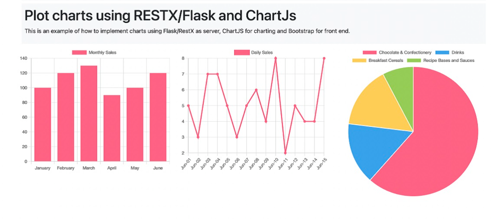

# Flask RESTX and ChartJS

This project is an example of how to implement charts using Flask/RestX as a backend server, ChartJS for charting, and Bootstrap 5 for styling.


## Project Structure

```
.gitattributes
.gitignore
LICENSE.md
README.md
api.py
app.py
data/
	monthly_customers.csv
	monthly_sales.csv
	product_sales.csv
data_loader.py
models.py
requirements.txt
static/
	js/
		custom.js
templates/
	index.html
```

## How to Run

1. Install the required packages from `requirements.txt`:

```sh
pip install -r requirements.txt
```

2. Run the Flask application:

```sh
python app.py
```

The application will be available at `http://localhost:5000`.

## API Endpoints

The application provides the following API endpoints:

- `/api/MonthlyCustomers`: Returns monthly customer data.
- `/api/MonthlySales`: Returns monthly sales data.
- `/api/ProductSales`: Returns product sales data.

These endpoints are used in the `custom.js` file to fetch data and display charts on the index page.

## License

This project is licensed under the MIT License. See the `LICENSE.md` file for details.